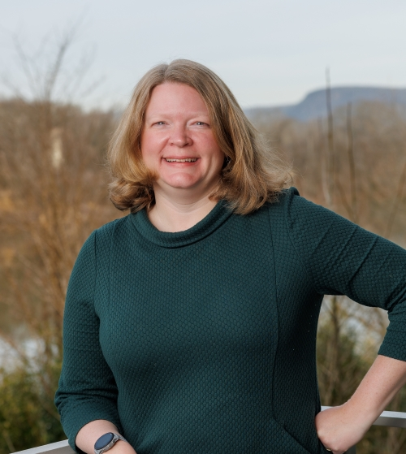
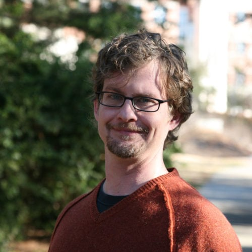
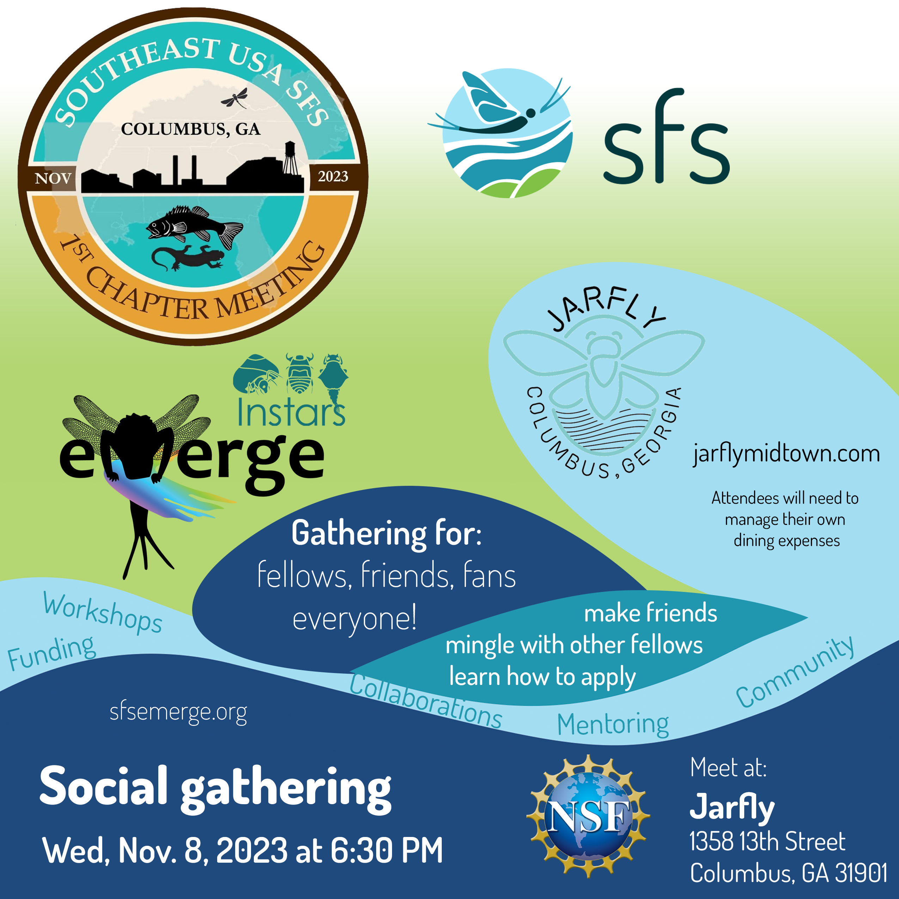

The first ever Southeast USA Chapter Meeting will be held November 8-9 at the Cunningham Conference Center in Columbus, GA.

## Schedule
- [At-a-glance](https://drive.google.com/file/d/1rtvaQmaz6yCKs-vCgeqswNs07LNuYub4/view?usp=sharing)
- [Presentation schedule](https://drive.google.com/file/d/1O5E3E0G7eBJ7gv5C1iq6QsmEwk-rgAPm/view?usp=sharing)

## Registration and title submission
- Register to attend the conference [here](https://secure.touchnet.com/C20612_ustores/web/product_detail.jsp?PRODUCTID=2496&FROMQRCODE=true). Early registration closes August 31st.
- Submit a title for an oral or poster presentation [here](https://columbusstate.formstack.com/forms/faculty_and_graduate_research_conference_proposal) through Sept 30th. Our focus will be providing opportunities for students and early career scientists.

Early Registration June 1st - August 31st
| Registration type | Price |
| ----------------- | ----- |
| Student/SE SFS Chapter members | $45 |
| Student/Non-members | $50 |
| Postdoc/Early Career Chapter members | $55 |
| Postdoc/Early Career non-members | $60 |
| Regular Chapter Members | $60 |
| Regular non-members | $65 |

Late Registration Sept 1 - Nov 1
| Registration type | Price |
| ----------------- | ----- |
| Student/SE SFS Chapter members | $55 |
| Student/Non-members | $60 |
| Postdoc/Early Career Chapter members | $65 |
| Postdoc/Early Career non-members | $70 |
| Regular Chapter Members | $70 |
| Regular non-members | $75 |

## Logistics
- [Conference center information](https://conference.columbusstate.edu/)
- [Coordinate ride share](https://docs.google.com/spreadsheets/d/1Xyq5hOKP3jWTuMt1YGy7npOpCpiQrQPMmdZHLKNVcjw/edit?usp=sharing)
- [Hotel deals](https://events.columbusstate.edu/hotels/)

## Plenary
### Changing the course: a proposal to dramatically raise the profile of southeastern aquatic biodiversity

Dr. Anna George, Vice President of Conservation Science and Education at the Tennessee Aquarium, discovered early in life that being a biologist provided a good excuse to be outside.  During her undergraduate and graduate coursework in biology at the University of Virginia and Saint Louis University, she worked in both freshwater and marine systems to study the conservation, ecology, and evolution of fishes. Since joining the Tennessee Aquarium in 2006, she has led research and outreach initiatives in habitat restoration, species reintroduction, and biodiversity protection for the diverse freshwater fauna of the southeastern United States.  Her enthusiasm for educating scientists and non-scientists alike reflects her passion for collaborative conservation problem-solving. 

Dr. Seth Wenger is a conservation biologist and freshwater ecologist at the University of Georgia Odum School of Ecology. He serves as the Director of Science of UGA's River Basin Center, which connects the water-related research at the university with management and policy needs. His lab group engages in a wide range of applied research in diverse locations, but with a special emphasis on understanding and managing threats to the exceptional freshwater biodiversity of the southeastern US. 

## Workshops
### Social Field Safety
Fieldwork is integral to the practice of freshwater science. However, researchers with marginalized identities face an increased risk of physical, psychological, and emotional harm while conducting field research due to discrimination from the local community and/or colleagues (Demery & Pipkin 2021). The risk of conflict and violence from identity-based discrimination is termed social safety risk (Pharr & Burgess 2023). Training to mitigate field risks has historically focused on environmental risks and excluded social safety risks (Demery & Pipkin 2021). Through a panel discussion and interactive scenarios exercise, this workshop will guide participants to consider the social field safety risks in their work and identify strategies to mitigate these risks.

### Mentor Mapping
This workshop will help participants identify their mentors and mentoring needs.

### SFS Emerge & Instars Social Gathering
When: Wed, Nov 8, 6:30 PM

Where: Jarfly (1358 13th St., Columbus, GA 31901)

Come mingle with SFS Emerge & Instars program leadership and Fellows! If you are a current or former Emerge or Instars fellow, interested in learning more, or just want to come say hi, please join us. Look for us in the Emerge hats.

*Please note: Attendees will need to manage their own dining expenses.*

